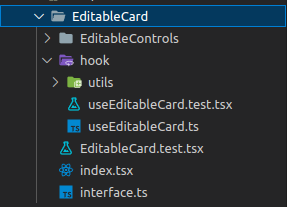

<div align="center">


</div>
<br/>
<br/>

## **💻 Project**

<p align="center">

</p>

<p align="center">

</p>

<p align="center">

</p>

<p align="center">

</p>

This **tdd Kanban** project was developed as an exercise to develop TDD architecture skills in frontend development. The layout in figma is [here](https://www.figma.com/file/a1Bwfmkw5w2BOdsV4PIeDy/Kanban-Board?node-id=0%3A1). We created a design pattern with the following structure:

<p align="center">

</p>

Each component that has react state has a hook folder to separate the business rules from the TSX component. That way, we were able to test hooks with [React Testing Library](https://react-hooks-testing-library.com/).

Each component has its own hook with its use cases.

**_useEditableCard.ts_**

```tsx
export const useEditableCard = (initialCard: ICard) => {
  const { column } = useColumn();
  const { list, removeCard } = useList();
  const { handleUpdateTask, handleUpdateFinished } = useKanban();

  const [finished, setFinished] = useState(initialCard.finished);
  const inputRef = useRef<HTMLInputElement>({} as HTMLInputElement);
  ... //more states

  const handleClickTag = useCallback(() => {
    ... //logic
  }, []);

  ...//more functions

  return {
    ... // more
    handleClickTag,
    handleEditTask,
    handleClickCheck,
    handleRemoveCard,
    handleClickCloseEdit,
  };
};
```

Then the hook is tested in its own file

**_useEditableCard.test.tsx_**

```tsx
describe('useEditableCard hook test', () => {

  const wrapper = ({ children }: BoxProps) => (
    ... //logic
  );

  const mockedUseList = vi
    .spyOn(useList, 'useList')
    .mockImplementation(
      () => ({ list: mockedList, AddCard: vi.fn(), removedCard: vi.fn() } as any),
    );
  beforeEach(() => {
    vi.restoreAllMocks();
  });

  it('should be false the finished state by default', () => {
    const { result } = renderHook(() => useEditableCard(mockedCard), { wrapper });
    act(() => {
      result.current.finished;
    });
    expect(result.current.finished).toEqual(true);
  });
  ... //more tests
});
```

The hook is imported into the component and its states and functions are consumed by the component.

**_📝 index.tsx_**

```tsx
function EditableCard({ card, cardIndex }: EditableCardsProps) {
  const {
    ...//more
    handleClickTag,
    handleEditTask,
    handleClickCheck,
    handleClickCloseEdit,
    handleRemoveCard,
  } = useEditableCard(card);

  return (
    ... //useEditableCard consumption
  )
}

export default EditableCard;
```

Finally, tests are performed that simulate user actions on the component:

**_EditableCard.test.tsx_**

```tsx
describe('EditableCard.tsx test', () => {

  const ContainerTest = () => (
   ... //logic
  );

  it('Should finished tag not to be in component', () => {
    const { getByText, debug } = render(<ContainerTest />);
    debug();
    expect(getByText('Finished')).toBeInTheDocument();
  });

  it('Should it added finished when click in tag', () => {
    const { getByTestId, getByText } = render(<ContainerTest />);
    fireEvent.click(getByTestId(`tag-${mockedCard.id}`));
    expect(() => getByText('Finished')).toThrow();
  });

  ...//more tests
});
```

This way we can test each component part separately.

All the kanban movement logic is in the onDragEnd function.

## **💥 Considerations**

Frontend tests help to standardize and minimize errors, user experience. It facilitates group work between development teams and contributes to a scalable and quality final solution.

## Get Started

```bash
yarn && yarn vite
```

## 🛠️ Test

```bash
yarn test
```

## **👨‍🚀 Author**

<a href="https://github.com/tpaphysics">

  <br />
  <sub>
    <b>Thiago Pacheco de Andrade</b>
  </sub>
</a>
<br />

👋 My contacts!

[](https://www.linkedin.com/in/thiago-pacheco-200a1a86/)
[](mailto:physics.posgrad.@gmail.com)
